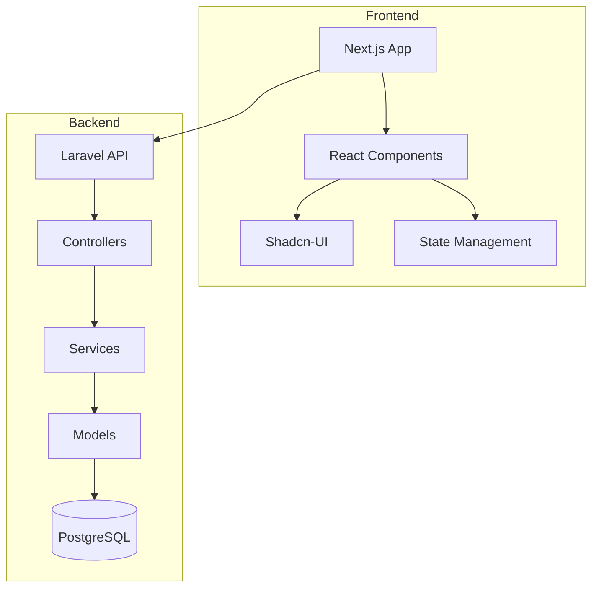
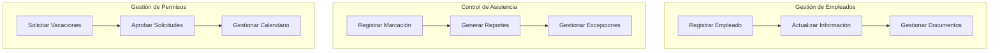
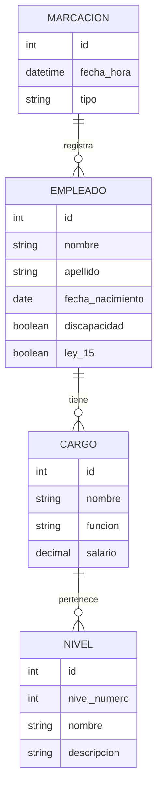

# Sistema de Recursos Humanos {#sistema-recursos-humanos}
**Enlace:** [design-doc](https://github.com/ghxstloner/sistema-rh)  
**Autor(es):** [Nombre del Autor](mailto:yoinerdeyhan@amaxoniaerp.com)  
**Estado:** En Desarrollo  
**Última Actualización:** Febrero 06, 2024

## Tabla de Contenidos
1. [Resumen Ejecutivo](#resumen-ejecutivo)
2. [Contexto](#contexto)
3. [Arquitectura del Sistema](#arquitectura-del-sistema)
4. [Diseño Detallado](#diseño-detallado)
5. [Modelo de Datos](#modelo-de-datos)
6. [Interfaces de Usuario](#interfaces-de-usuario)
7. [Pruebas y Validación](#pruebas-y-validacion)
8. [Consideraciones Futuras](#consideraciones-futuras)

## Resumen Ejecutivo {#resumen-ejecutivo}

Este documento describe el diseño de un Sistema de Recursos Humanos completo, desarrollado desde cero utilizando tecnologías modernas como Next.js 15, React 19 y Laravel. El sistema gestionará información completa de empleados, estructura organizacional, asistencia, beneficios y más.

## Contexto {#contexto}

La organización necesita un sistema moderno y flexible para la gestión de recursos humanos que permita:
- Gestión completa de información de empleados
- Estructura organizacional configurable de hasta 7 niveles
- Control de asistencia y marcaciones
- Gestión de vacaciones y licencias
- Seguimiento de amonestaciones y medidas disciplinarias
- Manejo de casos especiales (discapacidad, Ley 15)

## Arquitectura del Sistema {#arquitectura-del-sistema}

### Stack Tecnológico

Frontend:
- Next.js 15
- React 19
- Shadcn-ui para componentes de interfaz
- TypeScript para tipo seguro

Backend:
- Laravel como framework principal
- PostgreSQL como base de datos
- API RESTful para comunicación

### Diagrama de Arquitectura

## Diseño Detallado {#diseño-detallado}

### Casos de Uso Principales

### Módulos Principales

1. Gestión de Empleados
   - Registro de información personal
   - Gestión de cargos y funciones
   - Manejo de estructura organizacional
   - Control de salarios

2. Control de Asistencia
   - Registro de marcaciones
   - Control de horarios
   - Gestión de excepciones

3. Gestión de Permisos y Licencias
   - Solicitud y aprobación de vacaciones
   - Control de licencias médicas
   - Seguimiento de permisos especiales

## Modelo de Datos {#modelo-de-datos}

## Interfaces de Usuario {#interfaces-de-usuario}

### Propuesta de Diseño

El sistema utilizará Shadcn-ui para mantener una interfaz consistente y moderna. Los principales componentes incluirán:

1. Dashboard Principal
   - Resumen de personal activo
   - Indicadores clave
   - Notificaciones pendientes

2. Gestión de Empleados
   - Formularios de registro
   - Vistas de perfil
   - Gestión documental

3. Control de Asistencia
   - Registro de marcaciones
   - Reportes y estadísticas
   - Gestión de excepciones

## Pruebas y Validación {#pruebas-y-validacion}

### Estrategia de Pruebas

1. Pruebas Unitarias
   - Frontend: Jest + React Testing Library
   - Backend: PHPUnit para Laravel

2. Pruebas de Integración
   - API Testing
   - Flujos completos de procesos

3. Pruebas de Usuario
   - Validación de interfaces
   - Pruebas de usabilidad

### Métricas de Calidad

- Cobertura de código > 80%
- Tiempo de respuesta < 2s
- Disponibilidad 99.9%

## Consideraciones Futuras {#consideraciones-futuras}

1. Escalabilidad
   - Implementación de microservicios
   - Cache distribuido
   - Balanceo de carga

2. Integraciones
   - Sistema de planilla
   - Biométricos
   - ERP empresarial

3. Mejoras Planificadas
   - Módulo de evaluación de desempeño
   - Sistema de capacitaciones
   - App móvil

| Pros | Cons |
|------|------|
| Sistema modular y escalable | Complejidad inicial de desarrollo |
| Tecnologías modernas y robustas | Curva de aprendizaje para el equipo |
| Interfaz consistente con Shadcn-ui | Necesidad de migración de datos existentes |
| API bien estructurada | Tiempo de desarrollo inicial significativo |