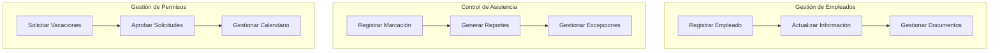
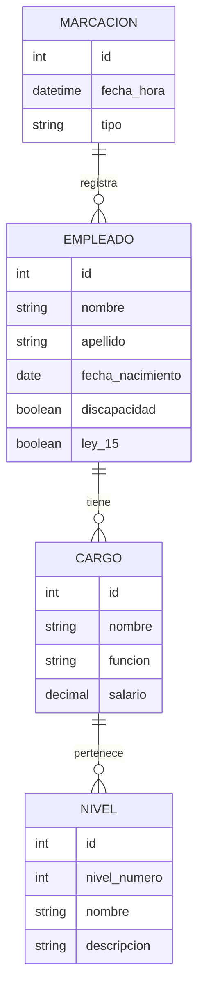

# Sistema de Recursos Humanos {#sistema-recursos-humanos}
**Enlace:** [design-doc](https://github.com/ghxstloner/sistema-rh)  
**Autor(es):** [Nombre del Autor](mailto:yoinerdeyhan@amaxoniaerp.com)  
**Estado:** En Desarrollo  
**Última Actualización:** Febrero 06, 2024

## Tabla de Contenidos
1. [Resumen Ejecutivo](#resumen-ejecutivo)
2. [Contexto](#contexto)
3. [Arquitectura del Sistema](#arquitectura-del-sistema)
4. [Diseño Detallado](#diseño-detallado)
5. [Modelo de Datos](#modelo-de-datos)
6. [Interfaces de Usuario](#interfaces-de-usuario)
7. [Pruebas y Validación](#pruebas-y-validacion)
8. [Consideraciones Futuras](#consideraciones-futuras)

## Resumen del Design Doc {#resumen-ejecutivo}

Este documento describe el diseño de un Sistema de Recursos Humanos completo, desarrollado desde cero utilizando tecnologías modernas como Next.js 15, React 19 y Laravel. El sistema gestionará información completa de empleados, estructura organizacional, asistencia, beneficios y más.

Esto debido a que el anterior sistema de Gestión Humana, está quedando con tecnologías obsoletas. Y debido a la necesidad de crecer de manera exponencial con la tecnología, tomamos esta decisión.

Los integrantes de la primera versión del documento son los siguientes:

- Valeria Urdaneta
- Luis Viera
- Francisco García
- Yoiner Moreno
- José Morales

## Contexto {#contexto}

La organización necesita un sistema moderno y flexible para la gestión de recursos humanos que permita:

- Gestión completa de información de empleados
- Estructura organizacional configurable de hasta 7 niveles
- Control de asistencia y marcaciones
- Gestión de vacaciones y licencias
- Seguimiento de amonestaciones y medidas disciplinarias
- Manejo de casos especiales (discapacidad, Ley 15)
- Control de Expediente

¿En qué se hace relación con el expediente?:

Véaselo como el historial del empleado/colaborador/funcionario dentro de la empresa. Ya que es necesario que cualquier modificación, sea cambio de departamento, cambio de vicepresidencia, cambio de grupo, aumento de salario, generación de licencia debe de quedar guardada en el historial.

## Arquitectura del Sistema {#arquitectura-del-sistema}

En cuanto al Stack Tecnológico tenemos lo siguiente:

### Stack Tecnológico

Frontend:
- Next.js 15
- React 19
- Shadcn-ui para componentes de interfaz
- TypeScript para tipo seguro

Backend:
- Laravel como framework principal
- PostgreSQL como base de datos
- API RESTful para comunicación

### Diagrama de Arquitectura

El diagrama anterior ilustra la arquitectura completa del sistema, mostrando la interacción entre los componentes del frontend y backend, así como el flujo de datos a través de las diferentes capas de la aplicación.

## Diseño Detallado {#diseño-detallado}

### Casos de Uso Principales

### Módulos Principales

1. Gestión de Empleados
   - Registro de información personal
   - Gestión de cargos y funciones
   - Manejo de estructura organizacional
   - Control de salarios

2. Control de Asistencia
   - Registro de marcaciones
   - Control de horarios
   - Gestión de excepciones

3. Gestión de Permisos y Licencias
   - Solicitud y aprobación de vacaciones
   - Control de licencias médicas
   - Seguimiento de permisos especiales

 4. Expediente del Empleado
   - Registrar cambio de departamento
   - Registrar aumento de salario
   - Registrar licencias

En cuanto a las amonestaciones y vacaciones no tengo la seguridad sí serán manejadas a través del expediente o en ese caso especial se utilizará desde la otra base de datos.

## Modelo de Datos {#modelo-de-datos}

En este caso, es el diagrama INICIAL (no es lo que quedará), de los modelos de datos. Tanto para la marcación, como del personal, su cargo y el nivel.

Recordar que el nivel hace referencia a la estructura organizacional. Se tiene estimado manejar 7 niveles como máximo.

## Interfaces de Usuario {#interfaces-de-usuario}

### Propuesta de Diseño

El sistema utilizará Shadcn-ui para mantener una interfaz consistente y moderna. Los principales componentes incluirán:

1. Dashboard Principal
   - Resumen de personal activo
   - Indicadores clave
   - Notificaciones pendientes
   - Marcaciones realizadas
   - Tabla para ver los próximos cumpleaños
   - Tabla para ver las marcaciones recientes
   - Total de empleados

2. Gestión de Empleados
   - Formularios de registro
   - Vistas de perfil
   - Gestión documental

3. Control de Asistencia
   - Visualización de marcaciones
   - Reportes y estadísticas
   - Gestión de excepciones

Recordar que para el punto 3, esto se manejará de manera externa. En el caso de los dispositivos, puede ser reflejado con la API de ZKTeco y/o la App de marcaciones.
Lo ideal es manejar la lógica que se pueda trabajar con la misma tabla para ambos casos.

## Pruebas y Validación {#pruebas-y-validacion}

### Estrategia de Pruebas

Por el momento no se tiene registrado realizar pruebas unitarias ya que desconozco como funcionaría para el caso de Laravel.

### Métricas de Calidad

De parte del FrontEnd, se puede obtener lo siguiente debido a las mejoras en rendimiento del Framework:

- Cobertura de código > 80%
- Tiempo de respuesta < 2s
- Disponibilidad 99.9%

## Consideraciones Futuras {#consideraciones-futuras}

1. Escalabilidad
   - Implementación de microservicios
   - Cache distribuido
   - Balanceo de carga

2. Integraciones
   - Sistema de planilla
   - Biométricos
   - ERP empresarial

3. Mejoras Planificadas
   - Módulo de evaluación de desempeño
   - Sistema de capacitaciones
   - App móvil

| Pros | Cons |
|------|------|
| Sistema modular y escalable | Complejidad inicial de desarrollo |
| Tecnologías modernas y robustas | Curva de aprendizaje para el equipo |
| Interfaz consistente con Shadcn-ui | Necesidad de migración de datos existentes |
| API bien estructurada | Tiempo de desarrollo inicial significativo |